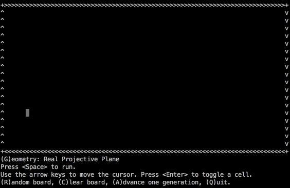

#`life` - Conway's Game of Life in Python 3

Play John Conway's
[Game of Life](https://en.wikipedia.org/wiki/Conway%27s_Game_of_Life)
in the terminal using the Python 3
[curses](https://docs.python.org/3.4/library/curses.html) module.
The game board can be changed between any of the following geometries:

* A rectangle
* A cylinder
* A [Möbius strip](https://en.wikipedia.org/wiki/Möbius_strip)
* A [torus](https://en.wikipedia.org/wiki/Torus)
* A [Klein bottle](https://en.wikipedia.org/wiki/Klein_bottle)
* The
[real projective plane](https://en.wikipedia.org/wiki/Real_projective_plane).

## Usage

Make sure Python 3.4 or later is installed on your system.
Run the following commands in your terminal:

    git clone https://github.com/artemmavrin/python-life.git
    cd python-life
    python3 life
